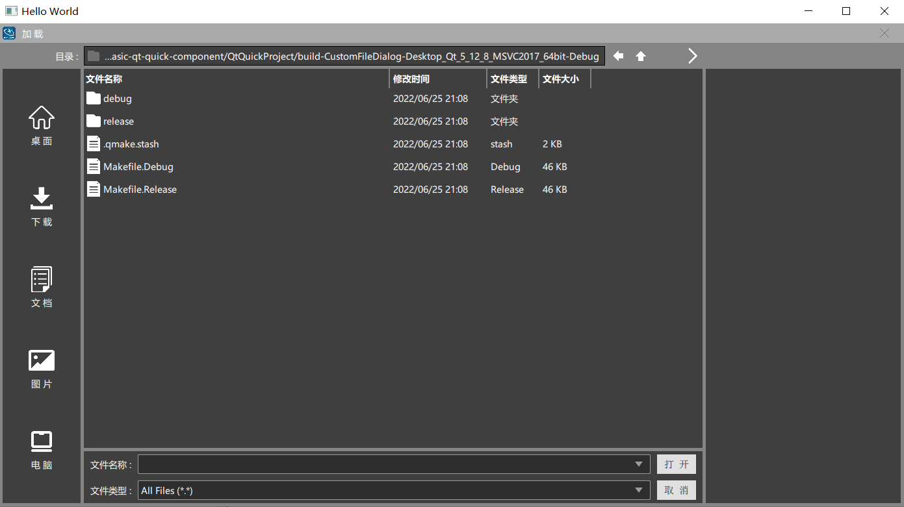
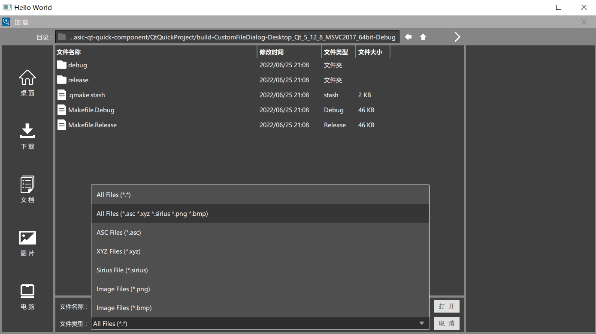
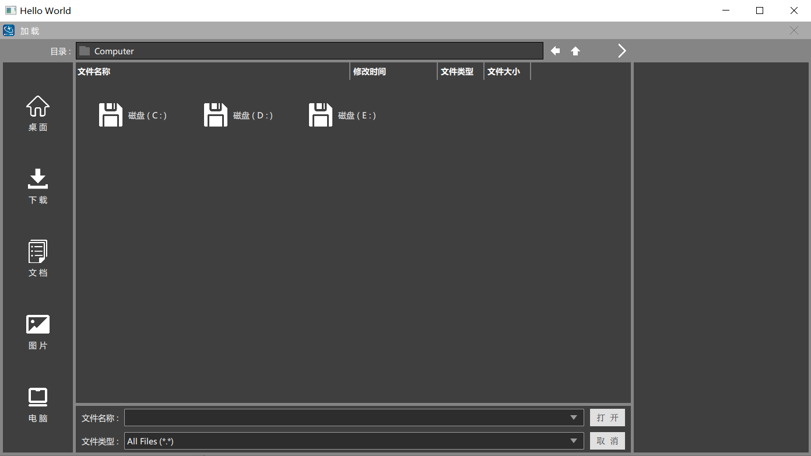
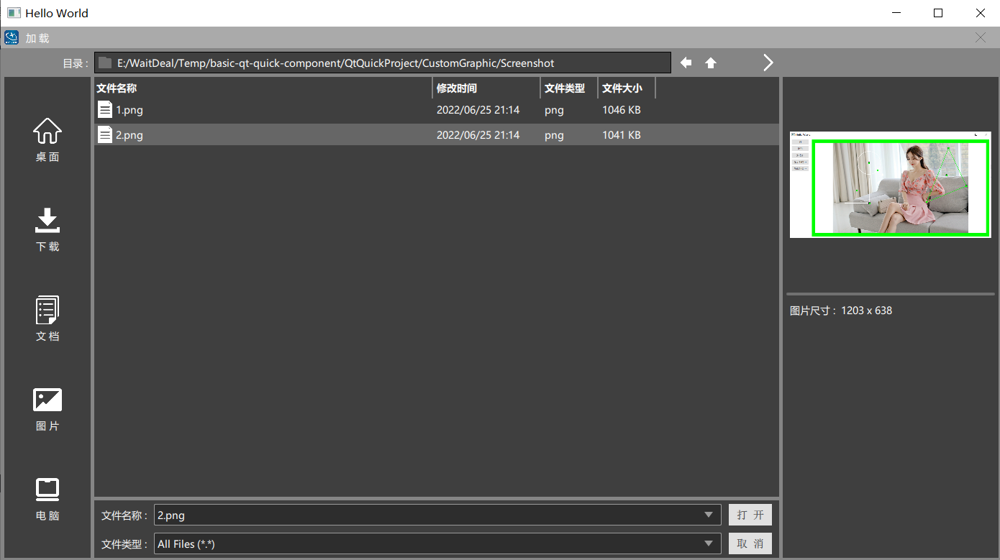
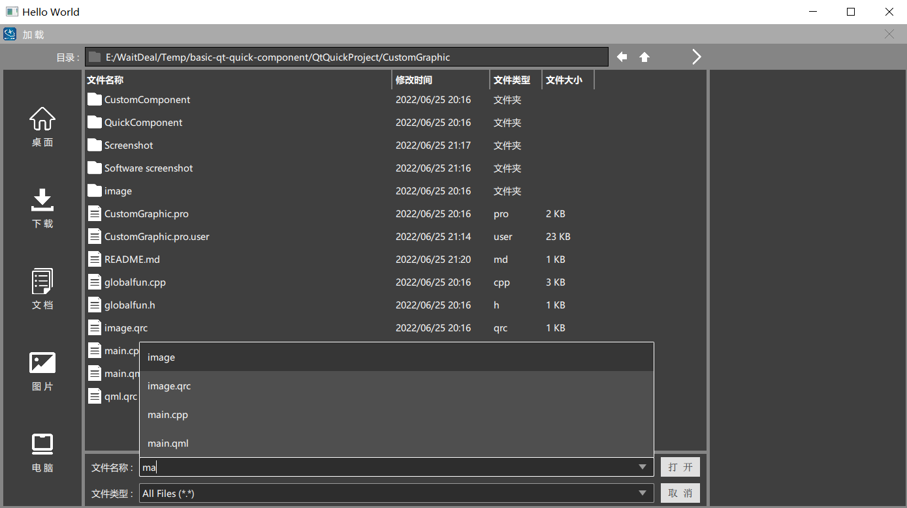

# 使用QtQuick实现简易的文件管理

## IDE：Qt 5.12.8 & Visual studio 2017

## 编译：打开Qt，选择MSVS2017 64即可

## 效果如下：

* 
* 
* 
* 
* 

## 基础功能

* 支持Ctrl多远
* 支持shift多选
* 支持鼠标拖动多选
* 可查看图片并显示图片大小
* 支持文件过滤
* 支持快捷跳转到桌面、下载、文档、图片和我的电脑
* 支持跳转到上一级目录与上一次目录
* 支持根据搜索的字符显示匹配的文件信息

