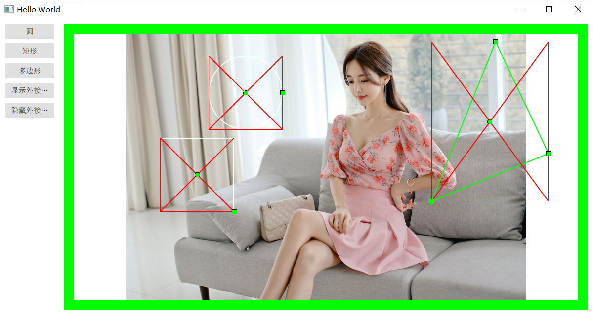
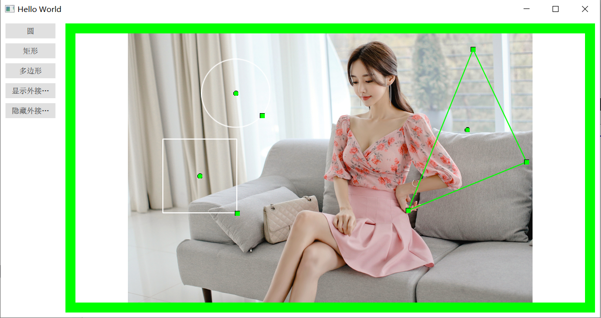

# 使用QtQuick实现QGraphicView
## IDE：Qt 5.12.8 & Visual studio 2017
## 编译：打开Qt，选择MSVS2017 64即可
## 效果如下：
* 
* 

## 基础功能
* 可绘制基础的圆、矩形，可根据想要的图形自行扩展
* 可绘制多边形，在点击多边形按钮后至少点击三个点，鼠标右键即可完成闭合
* 选择图元或点击圆心可拖动
* 选择图元可放大缩小
* 选择图元后鼠标右键可旋转
* 选择图元后鼠标右键可删除图元
* 可选择显示或隐藏图形的最小外接矩形
* 选择多边形后点击某个点进行拖动，可改变多边形形状
* 鼠标点击某个场景中的点，可沿着点击点通过鼠标滚轮进行放大缩小

